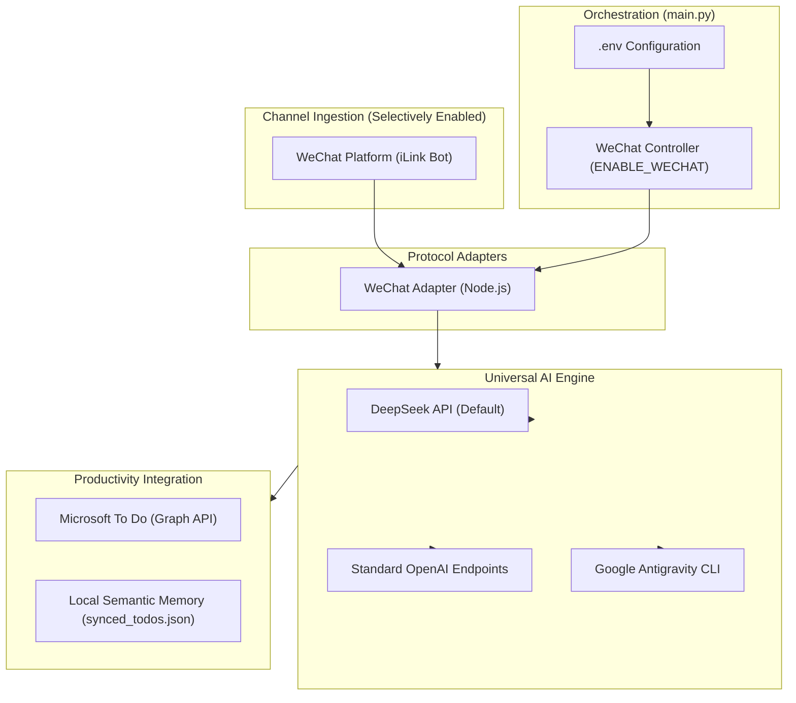

# 🌐 Omni-Assistant

<p align="center">
  
  
  
  
  
  
</p>

[简体中文文档 (Chinese Documentation)](README_CN.md)

> **Omni-Assistant** is an open-source personal AI assistant hub for **WeChat (Tencent Official iLink Bot Protocol)**, powered by **DeepSeek / OpenAI-compatible APIs** or **Google Antigravity CLI (`agy`)**, with schedule synchronization through **Microsoft To Do**.

---

## 🌟 Key Features

### 1. 🎛️ Selective Channel Toggling (Zero Mandatory Coupling)
- **WeChat-only runtime**: `ENABLE_WECHAT` controls the active iLink channel; disabled mode performs no gateway connection.
- **No QQ runtime dependency**: NapCat, OneBot, QQ ports, and QQ credentials are not loaded or deployed.

### 2. 🧠 Multi-Provider AI Engine (Default: Antigravity)
- **Out-of-the-Box**: Uses **Google Antigravity CLI (`agy`)** by default, with one private project workspace per WeChat user.
- **Standard Compatibility**: Compatible with any standard OpenAI chat completions endpoint (OpenAI, Moonshot, Qwen, SiliconFlow, Ollama, vLLM).
- **OpenAI-compatible APIs**: Set `AI_PROVIDER=openai` to use DeepSeek, OpenAI, or another compatible endpoint.

### 3. 📅 Microsoft To Do Native Integration
- **Semantic Deduplication**: Dynamically evaluates incoming group/private notices against existing tasks to identify whether an item is noise, duplicate, modification, or a new task.
- **Start-to-End Time Integrity**: Preserves complete time intervals (e.g., `2026-09-15 14:00 - 16:00`).
- **Native 15-Minute Alarms**: Translates natural language dates into standard ISO 8601 timestamps and sets native system alarms 15 minutes prior.

### 4. 💬 Channel-Specific Optimizations
- **WeChat Adapter (Node.js iLink)**:
  - Official protocol, avoiding web-wechat ban risks.
  - Automatic AES-128-ECB decryption for images, videos (with 50MB guardrail and cover fallback), and document files.
  - Preserves quote-reply context.
### 4. 🔌 Future channel extension
- `core/channel.py` defines transport-independent message and adapter contracts.
- The former QQ implementation is archived under `legacy/qq`; a future adapter can be added without changing the active WeChat, agy, or To Do core.

### 5. 👥 Multi-user binding and isolation
- One WeChat bot instance can serve multiple iLink users, identified by `from_user`.
- Each user receives an isolated Microsoft To Do binding, agy conversation, media directory, and local memory; unbound users are blocked from the task-processing path.
- On first contact, send `/bind_todo`. The service starts the user's isolated Microsoft Device Code flow and sends the Microsoft sign-in URL and device code back through WeChat; the user completes authorization independently without server-side manual configuration.
- `/binding_status` reports the current user's status, and `/reset` only clears that user's agy conversation.

---

## 🏛️ System Architecture



---

## 🚀 Quickstart

### 1. Clone & Setup
```bash
git clone https://github.com/your-username/omni-assistant.git
cd omni-assistant
```

### 2. Install Dependencies
```bash
# Python dependencies
pip install -r requirements.txt

# Node.js dependencies (for WeChat or To Do)
npm install
```

### 3. Configure `.env`
```bash
cp .env.example .env
```
Edit `.env` to enable the channels and models of your choice:
```bash
# Enable WeChat
ENABLE_WECHAT=true

# AI Provider (Antigravity is default)
AI_PROVIDER=agy
LLM_BASE_URL=https://api.deepseek.com/v1
LLM_API_KEY=sk-your-deepseek-api-key
LLM_MODEL=deepseek-chat
```

### 4. Verify & Run
```bash
# Run configuration self-check
python3 main.py --check-only

# Start daemon
python3 main.py
```

---

## 🛡️ Security & Desensitization

This project strictly adheres to a zero-leakage security boundary:
- No personal account identifiers or credentials exist in the default configuration; QQ is reserved only as an inactive future adapter namespace.
- Runtime session tokens, local To Do caches, media downloads, and logs are automatically ignored by `.gitignore`.
- Built-in audit tests:
  ```bash
  python3 tests/test_desensitization.py
  python3 tests/test_git_isolation.py
  ```

---

## 📄 License
Released under the [MIT License](LICENSE).
