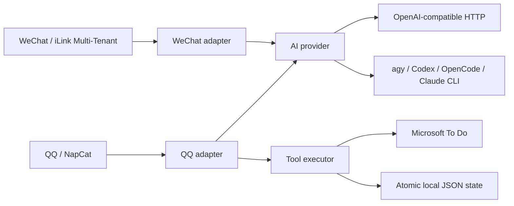

# Omni-Assistant

<p align="center">
  
  
  
  
  
  
</p>

Omni-Assistant is an open-source, multi-channel self-hosted personal AI assistant hub supporting **WeChat (Tencent Official iLink Protocol with Multi-Tenant Hot-Join & Web Portal)** and **QQ (NapCat OneBot v11)**. It can extract actionable notices, synchronize them to Microsoft To Do with time integrity, and answer user requests driven by **Google Antigravity CLI (`agy`)**, local coding CLIs (Codex, OpenCode, Claude Code), or standard OpenAI-compatible APIs (DeepSeek, OpenAI, Ollama).

[中文文档](README_CN.md)

## What it does

- **QQ via NapCat OneBot v11**
  - Watches selected groups without speaking in those groups.
  - Sends detected tasks and updates to the administrator privately.
  - Provides an administrator-only agent loop with tools for listing, adding,
    updating, and deleting To Do items, plus reading recent group material.
  - Cleans Markdown and internal tool payloads before sending QQ messages.
- **WeChat via Tencent iLink**
  - Uses the official iLink bot protocol.
  - Supports QR login, quote context, long polling, and automatic reconnect.
  - Decrypts supported images, videos, and documents with a size guard.
  - Stores authentication, conversation, sync, and media data under
    `data/wechat/`.
- **Microsoft To Do**
  - Converts notices into tasks with semantic duplicate/update decisions.
  - Preserves start/end time text and creates native due/reminder timestamps.
  - Uses a local signature cache to avoid duplicate task creation.
- **Pluggable AI backends**
  - OpenAI-compatible HTTP APIs: DeepSeek, OpenAI, Moonshot, Qwen, Ollama,
    vLLM, and compatible gateways.
  - Optional local CLIs: Antigravity (`agy`), Codex, OpenCode, and Claude Code.
  - The QQ agent keeps native OpenAI tool calling. Local CLI agents use the
    same local tools through a JSON `tool_call` / `final` protocol.

## 🌟 Key Features

### 1. 🎛️ Selective Channel Toggling (Zero Mandatory Coupling)
- **WeChat-only runtime**: `ENABLE_WECHAT` controls the active iLink channel; disabled mode performs no gateway connection.
- **QQ channel**: Native support via NapCat OneBot v11 when `ENABLE_QQ=true`. Disabled channels are not loaded or connected.

### 2. 🧠 Multi-Provider AI Engine (Default: Google Antigravity)
- **Out-of-the-Box**: Uses **Google Antigravity CLI (`agy`)** by default, with an isolated sandbox directory per user and real-time streaming telemetry.
- **Local CLI Engines**: Direct support for `codex`, `opencode`, and `claude`.
- **Standard Compatibility**: Full support for any standard OpenAI-compatible API (DeepSeek, OpenAI, Moonshot, Qwen, SiliconFlow, Ollama, vLLM).

### 3. 👥 Multi-Account WeChat Hot-Join & Web Portal
- **Zero-Downtime Hot-Join**: New accounts can scan QR codes anytime without restarting the main process or dropping existing sessions.
- **Web QR Portal**: Real-time web UI on `http://localhost:3000` to inspect connection status and scan QR codes from mobile or desktop.
- **Parallel Polling**: Each logged-in account runs independent long polling with dynamic failure recovery and auto-reconnect.

### 4. 📅 Microsoft To Do Native Integration
- **Semantic Deduplication**: Evaluates incoming notices against existing tasks to identify duplicates, modifications, or new tasks.
- **Start-to-End Time Integrity**: Preserves complete time intervals (e.g., `2026-09-15 14:00 - 16:00`).
- **Native 15-Minute Alarms**: Translates natural dates into ISO 8601 timestamps and sets native system alarms 15 minutes prior.

---

## Architecture



Disabled channels are not imported or connected. You can run QQ only, WeChat
only, or both.

## Requirements

- Python 3.10+
- Node.js 18+
- `npm` when using WeChat, Microsoft To Do, or local CLI installation
- A configured AI backend
- NapCat OneBot v11 only when QQ is enabled
- Microsoft To Do authentication only when `ENABLE_MS_TODO=true`

## Quick start

### 1. Install

```bash
git clone https://github.com/waaogg/omni-assistant.git
cd omni-assistant

python -m pip install -r requirements.txt
npm install
```

Install test dependencies when developing:

```bash
python -m pip install -r requirements-dev.txt
```

### 2. Configure

```bash
cp .env.example .env
```
Edit `.env` to enable the channels and models of your choice:

```dotenv
ENABLE_QQ=false
ENABLE_WECHAT=true

# AI Provider (Google Antigravity is default)
AI_PROVIDER=agy

# Or switch to standard OpenAI/DeepSeek API:
# AI_PROVIDER=openai
LLM_BASE_URL=https://api.deepseek.com/v1
LLM_API_KEY=sk-your-key
LLM_MODEL=deepseek-chat
LLM_TEMPERATURE=0.1
```

The complete configuration template is in [`.env.example`](.env.example).

### 3. Validate and run

```bash
python main.py --check-only
python main.py
```

`--check-only` does not connect to the enabled channels. It validates provider,
URL, numeric, and channel settings and exits with code `2` for invalid
configuration.

## AI providers

### OpenAI-compatible HTTP

Use:

```dotenv
AI_PROVIDER=openai
LLM_BASE_URL=https://api.deepseek.com/v1
LLM_API_KEY=your-key
LLM_MODEL=deepseek-chat
```

`deepseek`, `default`, and `openai` are accepted as HTTP provider aliases.

### Optional local CLIs

Select one backend:

```dotenv
AI_PROVIDER=codex
AUTO_INSTALL_CLI=false
```

Supported values are `agy`, `codex`, `opencode`, and `claude`.

When `AUTO_INSTALL_CLI=true`, startup installs missing verified npm packages:

| Provider | Package | Executable |
| --- | --- | --- |
| Codex | `@openai/codex` | `codex` |
| OpenCode | `opencode-ai` | `opencode` |
| Claude Code | `@anthropic-ai/claude-code` | `claude` |

Antigravity distribution is environment-specific, so configure its installer
explicitly:

```dotenv
AI_PROVIDER=agy
AUTO_INSTALL_CLI=true
AGY_INSTALL_COMMAND=your-approved-install-command
```

You can override executable paths and arguments with:

```dotenv
CODEX_BIN_PATH=codex
CODEX_ARGS=exec --json "{prompt}"
OPENCODE_BIN_PATH=opencode
OPENCODE_ARGS=run --format json "{prompt}"
CLAUDE_BIN_PATH=claude
CLAUDE_ARGS=-p "{prompt}" --output-format json
AGY_BIN_PATH=agy
AGY_ARGS=-p "{prompt}" --output-format json
```

Automatic installation is opt-in. CLI authentication and provider-specific
permissions are still performed by the user in the target environment.

## Channel configuration

### QQ

Set:

```dotenv
ENABLE_QQ=true
ADMIN_QQ=your-admin-qq-number
TARGET_GROUP_IDS=group-id-1,group-id-2
NAPCAT_HTTP_URL=http://127.0.0.1:3000
NAPCAT_WS_URL=ws://127.0.0.1:3001
NAPCAT_TOKEN=
```

The adapter listens to configured groups, stores a bounded local message
history, and reports actionable notices privately to `ADMIN_QQ`.

### WeChat

Set:

```dotenv
ENABLE_WECHAT=true
WECHAT_BASE_URL=https://ilinkai.weixin.qq.com
WECHAT_DATA_DIR=./data/wechat
```

On first start, scan the QR code printed by the adapter. The Python supervisor
restarts the Node adapter after an unexpected exit and terminates it cleanly
when the service stops.

### Microsoft To Do

```dotenv
ENABLE_MS_TODO=true
MS_TODO_DEFAULT_LIST_ID=
MS_TODO_AUTH_MODULE_PATH=/path/to/auth.js
DEFAULT_REMINDER_ADVANCE_MINUTES=15
```

Shopping and delivery tasks disable reminders by design. Task memory is stored
in `data/synced_todos.json`; group history is stored in
`data/group_history.json`.

## Data and security

Runtime data is intentionally excluded from Git:

- `.env` and access tokens
- WeChat authentication and conversation state
- To Do memory and group history
- decrypted media
- logs, databases, and temporary files

Do not commit personal IDs, tokens, cookies, or downloaded media. Review
`.gitignore` before deploying or sharing a backup.

## Development and verification

Run the complete test suite:

```bash
python -m pytest -q
python -m compileall -q .
node --check core/ai_provider.js
node --check adapters/wechat/wechat_bot.js
```

The tests cover provider requests, CLI tool loops, nested CLI JSONL output,
configuration validation, channel toggles, desensitization, Git isolation,
atomic JSON storage, and time parsing.

## Dashboard

Run the local setup and operations panel:

```bash
python dashboard.py
```

Open `http://127.0.0.1:8765`. The panel can edit the common provider/channel
settings, start/restart/stop the assistant, and stream recent supervisor
output. Configuration is saved to `.env` atomically and requires a restart to
take effect. It binds to localhost by default and masks API keys/tokens; set
`DASHBOARD_HOST`, `DASHBOARD_PORT`, and optionally `DASHBOARD_TOKEN` in the
environment before exposing it through a reverse proxy.

## Deployment

### Docker Compose

The repository includes:

- `deploy/Dockerfile`
- `deploy/docker-compose.yml`

Review `.env`, volume paths, exposed ports, and NapCat authentication before
using Compose in production.

### systemd

Use `deploy/systemd/omni-assistant.service` as a starting point. Change the
working directory, service user, and environment file path for the target host.

## License

MIT. See [LICENSE](LICENSE).
