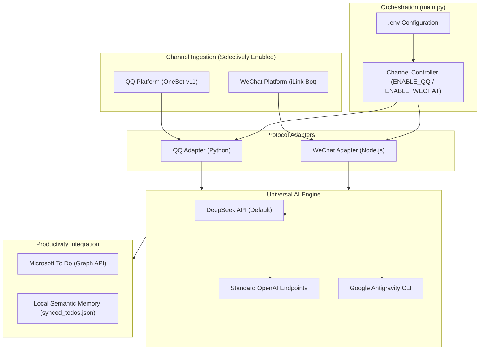

# 🌐 Omni-Assistant

<p align="center">
  
  
  
  
  
  
</p>

[简体中文文档 (Chinese Documentation)](README_CN.md)

> **Omni-Assistant** is an open-source, multi-channel personal AI assistant hub.  
> It integrates **QQ (NapCat OneBot v11)** and **WeChat (Tencent Official iLink Bot Protocol)** under a unified architecture, powered by **DeepSeek / OpenAI-compatible APIs** or **Google Antigravity CLI (`agy`)**, seamlessly synchronizing schedules with **Microsoft To Do**.

---

## 🌟 Key Features

### 1. 🎛️ Selective Channel Toggling (Zero Mandatory Coupling)
- **Independent Channels**: QQ and WeChat operate independently via `ENABLE_QQ` and `ENABLE_WECHAT` toggles in `.env`.
- **Zero Overhead**: Disabled channels do not initialize, make network requests, or demand prerequisite credentials.
- **Flexible Modes**: Run QQ-only, WeChat-only, or both channels simultaneously.

### 2. 🧠 Multi-Provider AI Engine (Default: DeepSeek)
- **Out-of-the-Box**: Pre-configured with **DeepSeek Official API (`https://api.deepseek.com/v1`)** and `deepseek-chat`.
- **Standard Compatibility**: Compatible with any standard OpenAI chat completions endpoint (OpenAI, Moonshot, Qwen, SiliconFlow, Ollama, vLLM).
- **Google Antigravity CLI**: Native support for running local Antigravity agent subprocesses (`AI_PROVIDER=agy`).

### 3. 📅 Microsoft To Do Native Integration
- **Semantic Deduplication**: Dynamically evaluates incoming group/private notices against existing tasks to identify whether an item is noise, duplicate, modification, or a new task.
- **Start-to-End Time Integrity**: Preserves complete time intervals (e.g., `2026-09-15 14:00 - 16:00`).
- **Native 15-Minute Alarms**: Translates natural language dates into standard ISO 8601 timestamps and sets native system alarms 15 minutes prior.

### 4. 💬 Channel-Specific Optimizations
- **WeChat Adapter (Node.js iLink)**:
  - Official protocol, avoiding web-wechat ban risks.
  - Automatic AES-128-ECB decryption for images, videos (with 50MB guardrail and cover fallback), and document files.
  - Preserves quote-reply context.
- **QQ Adapter (Python OneBot)**:
  - Autonomous ReAct loop with real tools (`list_todos`, `add_todo`, `update_todo`, `delete_todos`, `get_group_materials`).
  - Strict group silence; notices are delivered privately to the administrator.
  - Markdown sanitizer to prevent broken formatting on QQ clients.

---

## 🏛️ System Architecture



---

## 🚀 Quickstart

### 1. Clone & Setup
```bash
git clone https://github.com/your-username/omni-assistant.git
cd omni-assistant
```

### 2. Install Dependencies
```bash
# Python dependencies
pip install -r requirements.txt

# Node.js dependencies (for WeChat or To Do)
npm install
```

### 3. Configure `.env`
```bash
cp .env.example .env
```
Edit `.env` to enable the channels and models of your choice:
```bash
# Enable channels
ENABLE_QQ=true
ENABLE_WECHAT=true

# AI Provider (DeepSeek is default)
AI_PROVIDER=openai
LLM_BASE_URL=https://api.deepseek.com/v1
LLM_API_KEY=sk-your-deepseek-api-key
LLM_MODEL=deepseek-chat
```

### 4. Verify & Run
```bash
# Run configuration self-check
python3 main.py --check-only

# Start daemon
python3 main.py
```

---

## 🛡️ Security & Desensitization

This project strictly adheres to a zero-leakage security boundary:
- No personal QQ numbers, WeChat IDs, group IDs, or personal names exist in the repository.
- Runtime session tokens, local To Do caches, media downloads, and logs are automatically ignored by `.gitignore`.
- Built-in audit tests:
  ```bash
  python3 tests/test_desensitization.py
  python3 tests/test_git_isolation.py
  ```

---

## 📄 License
Released under the [MIT License](LICENSE).
