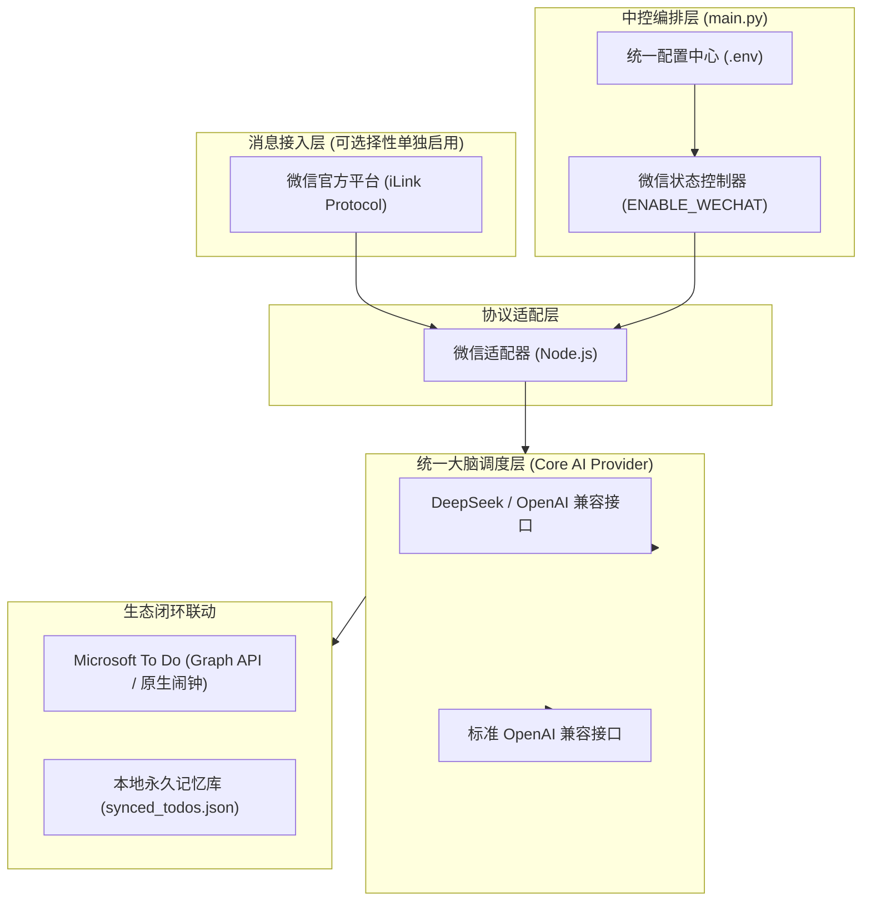

# 🌐 Omni-Assistant (微信个人智能助理)

<p align="center">
  
  
  
  
  
  
</p>

> **Omni-Assistant** 是一款专为个人打造的开源全渠道智能中控管家。
> 深度接入 **微信（腾讯官方 iLink 机器人协议，支持多账号无缝热加入与 Web 扫码控制台）** 与 **QQ（NapCat OneBot v11）**，底层由 **Google Antigravity CLI (`agy`)**、本地编码 CLI（Codex、OpenCode、Claude）或 **OpenAI 兼容端点**（DeepSeek、OpenAI、Ollama 等）驱动，并联动 **Microsoft To Do** 实现日程提取、语义防重、起止时间完整性管理与原生系统强提醒。

---

## 🌟 核心特性

### 1. 🎛️ 微信通道按需启动
- 微信通道通过 `.env` 中的 `ENABLE_WECHAT` 控制；关闭时不会发起 iLink 网络连接。
- QQ/NapCat/OneBot 不属于当前运行面，不再创建账号、端口或容器依赖。

### 2. 🧠 可插拔多 AI 中控调度（默认 Antigravity）
- **开箱即用**：默认接入 **Google Antigravity CLI (`agy`)**，微信端各用户拥有独立安全沙箱，支持子进程全流程流式监控与会话自动愈合。
- **本地代码 CLI 引擎**：原生支持 `AI_PROVIDER=agy|codex|opencode|claude`。设置 `AUTO_INSTALL_CLI=true` 可自动安装已核实的 npm CLI；`agy` 因发行包依环境而异，可显式指定 `AGY_INSTALL_COMMAND`。
- **标准兼容**：全面兼容任何符合 OpenAI API 规范的端点（如 DeepSeek、OpenAI、Moonshot、通义千问、SiliconFlow、本地 Ollama/vLLM 等）。
- **工具兼容**：QQ 保留原生 OpenAI 工具调用；本地 CLI 使用统一 JSON 工具协议（`tool_call` / `final`），执行同一套本地工具。

### 3. 📅 微软待办原生嵌入与提前 15 分钟闹钟 (Microsoft To Do)
- **语义级防重与动态修正**：捕捉群通知时携带现有未完成待办，由大模型裁决是闲聊 (`ignore`)、重复 (`duplicate`)、修正现有事项 (`update`) 还是全新待办 (`new`)。
- **起止时间完整性**：自动提取开始时间与结束时间（如 `2026年9月15日 14:00 - 16:00`），杜绝时间断章。
- **系统级原生弹窗**：自动转化为 ISO 8601 时间戳，默认提前 15 分钟触发手机/PC/Apple Watch 原生闹钟。
- **购物与快递合并**：买东西/寄快递类待办自动原地合并追加，不设响铃。

### 4. 💬 渠道专属原生体验
- **微信端（Node.js iLink 适配器）**：
  - 直连腾讯官方 iLink 通道，免网页版微信封号风险；
  - 自动 AES-128-ECB 解密接收图片、视频与各格式文档，内置 50MB 超限熔断与封面降级保护；
  - 支持微信引用历史消息解析。
### 4. 🔌 未来渠道扩展
- `core/channel.py` 定义与传输协议无关的消息事件和适配器契约。
- QQ 实现已从活动工程隔离；未来可按同一契约重新实现，不影响微信、agy 和 To Do 核心。

### 5. 👥 多用户绑定与数据隔离
- 同一个微信机器人实例可以服务多个微信用户；身份以 iLink 的 `from_user` 区分。
- 每个用户拥有独立的 Microsoft To Do 绑定、agy 会话、媒体目录和本地记忆，未绑定用户不会进入待办处理链路。
- 首次私聊发送 `/bind_todo`，系统会自动启动该用户独立的 Microsoft Device Code 授权流程，并把 Microsoft 登录网址和设备码直接发回微信；用户自行在手机浏览器完成授权，无需服务端手工配置。
- `/binding_status` 查看绑定状态，`/reset` 只清除当前用户的 agy 会话。

---

## 🏛️ 系统架构



---

## 🚀 快速开始

### 1. 获取项目代码
```bash
git clone https://github.com/your-username/omni-assistant.git
cd omni-assistant
```

### 2. 环境安装
- **Python 环境** (Python 3.10+):
  ```bash
  pip install -r requirements.txt
  # 运行测试时再安装
  pip install -r requirements-dev.txt
  ```
- **Node.js 环境** (Node.js 18+，若启用微信或 To Do 模块):
  ```bash
  npm install
  ```

### 3. 配置环境变量
复制模板生成 `.env` 文件：
```bash
cp .env.example .env
```

打开 `.env` 填入配置（**未启用的通道无需填写**）：
```bash
# 1. 开启微信通道
ENABLE_WECHAT=true

# 2. 配置 AI 大模型或本地 CLI（默认使用 Google Antigravity）
AI_PROVIDER=agy
AUTO_INSTALL_CLI=false

# 若切换为标准 OpenAI / DeepSeek 接口：
# AI_PROVIDER=openai
LLM_BASE_URL=https://api.deepseek.com/v1
LLM_API_KEY=sk-your-deepseek-api-key
LLM_MODEL=deepseek-chat

# 3. 若启用微信 (ENABLE_WECHAT=true)
# 首次运行终端会输出登录二维码，微信扫码即可自动完成绑定
```

### 4. 验证配置
```bash
python3 main.py --check-only
```

配置自检发现非法通道、URL、数字或 AI 驱动配置时会以退出码 `2` 失败，便于
容器和 systemd 快速阻断错误部署。待办、群历史和微信会话状态均采用原子替换
写入，进程中断时不会留下半截 JSON 文件。

### 5. 启动服务
```bash
python3 main.py
```

---

## 🛡️ 安全与隐私声明 (Security & Zero-Leakage)

1. **绝对脱敏**：本项目源码与默认配置模板中绝不含个人 QQ 号、微信号、群号、姓名、Token 或密钥；QQ 仅作为未来适配器接口预留。
2. **本地数据隔离**：`.gitignore` 深度配置，所有本地会话缓存（`auth.json`、`conversations.json`、`sync_buf.txt`）、待办记忆（`synced_todos.json`）、聊天历史（`group_history.json`）及媒体解密文件均默认物理排除在版本控制之外。
3. **安全自检命令**：
   ```bash
   python3 tests/test_desensitization.py
   python3 tests/test_git_isolation.py
   python3 -m pytest -q
   ```

---

## 📄 开源许可证
本项目基于 [MIT License](LICENSE) 协议开源。
## 图形化设置与运行面板

启动本地 Dashboard：

```bash
python dashboard.py
```

然后访问 `http://127.0.0.1:8765`。面板支持初始配置常用的 AI/QQ/微信/To Do
选项、启动/重启/停止助手进程，并查看最近的监督进程输出。配置会原子写入
`.env`，保存后需要重启服务才会生效；API Key 和 Token 只显示掩码。

面板默认只监听本机。如需通过反向代理访问，请在环境中设置
`DASHBOARD_HOST`、`DASHBOARD_PORT`，并配置 `DASHBOARD_TOKEN` 后再暴露到网络。
