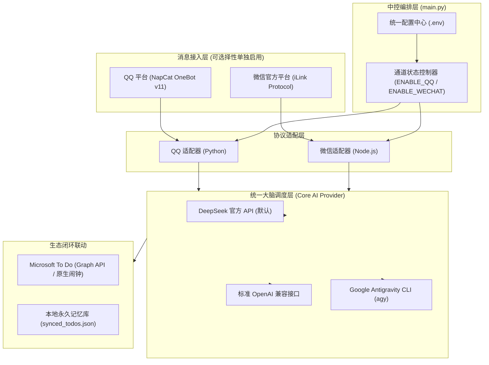

# 🌐 Omni-Assistant (全渠道个人智能助理)

<p align="center">
  
  
  
  
  
  
</p>

> **Omni-Assistant** 是一款专为个人打造的开源全渠道智能中控管家。  
> 深度融合 **QQ（NapCat OneBot v11）** 与 **微信（腾讯官方 iLink 机器人协议）** 双渠道，底层支持 **DeepSeek 等主流大模型（标准 OpenAI 兼容接口）** 与 **Google Antigravity CLI (`agy`)** 混合驱动，联动 **Microsoft To Do** 实现日程提取、语义防重、起止时间完整性管理与原生系统强提醒。

---

## 🌟 核心特性

### 1. 🎛️ 通道按需选配启动（零强制依赖）
- **完全解耦**：QQ 与微信通道各自独立，通过 `.env` 中的 `ENABLE_QQ` 与 `ENABLE_WECHAT` 独立开关。
- **无感静默**：未配置或设为 `false` 的通道不会加载模块、不发起网络连接、不报错、不要求任何前置依赖。
- **灵活组合**：支持“仅 QQ”、“仅微信”或“QQ + 微信双通道并发运行”。

### 2. 🧠 多 AI 后端中控调度（默认 DeepSeek）
- **开箱即用**：默认预设接入 **DeepSeek 官方 API (`https://api.deepseek.com/v1`)** 与 `deepseek-chat` 模型，仅需填入 API Key 即可启动。
- **标准兼容**：全面兼容任何符合 OpenAI API 规范的端点（如 OpenAI、Moonshot、通义千问、SiliconFlow、本地 Ollama/vLLM 等）。
- **Antigravity CLI 支持**：无缝支持切换至 Google Antigravity CLI 本地智能体进程模式 (`AI_PROVIDER=agy`)。

### 3. 📅 微软待办原生嵌入与提前 15 分钟闹钟 (Microsoft To Do)
- **语义级防重与动态修正**：捕捉群通知时携带现有未完成待办，由大模型裁决是闲聊 (`ignore`)、重复 (`duplicate`)、修正现有事项 (`update`) 还是全新待办 (`new`)。
- **起止时间完整性**：自动提取开始时间与结束时间（如 `2026年9月15日 14:00 - 16:00`），杜绝时间断章。
- **系统级原生弹窗**：自动转化为 ISO 8601 时间戳，默认提前 15 分钟触发手机/PC/Apple Watch 原生闹钟。
- **购物与快递合并**：买东西/寄快递类待办自动原地合并追加，不设响铃。

### 4. 💬 渠道专属原生体验
- **微信端（Node.js iLink 适配器）**：
  - 直连腾讯官方 iLink 通道，免网页版微信封号风险；
  - 自动 AES-128-ECB 解密接收图片、视频与各格式文档，内置 50MB 超限熔断与封面降级保护；
  - 支持微信引用历史消息解析。
- **QQ 端（Python OneBot 适配器）**：
  - 私聊专属 ReAct 闭环智能体，拥有真实查待办、增待办、改待办、删待办工具；
  - 严格群内静默，提取的通知以私人管家口吻单向私聊汇报；
  - 纯净排版过滤器，彻底过滤加粗、反引号等导致 QQ 视觉混乱的 Markdown 标记。

---

## 🏛️ 系统架构



---

## 🚀 快速开始

### 1. 获取项目代码
```bash
git clone https://github.com/your-username/omni-assistant.git
cd omni-assistant
```

### 2. 环境安装
- **Python 环境** (Python 3.10+):
  ```bash
  pip install -r requirements.txt
  ```
- **Node.js 环境** (Node.js 18+，若启用微信或 To Do 模块):
  ```bash
  npm install
  ```

### 3. 配置环境变量
复制模板生成 `.env` 文件：
```bash
cp .env.example .env
```

打开 `.env` 填入配置（**未启用的通道无需填写**）：
```bash
# 1. 开启你需要的通道
ENABLE_QQ=true
ENABLE_WECHAT=true

# 2. 配置 AI 大模型 (默认已填好 DeepSeek Base URL，只需填 Key)
AI_PROVIDER=openai
LLM_BASE_URL=https://api.deepseek.com/v1
LLM_API_KEY=sk-your-deepseek-api-key
LLM_MODEL=deepseek-chat

# 3. 若启用 QQ (ENABLE_QQ=true)
ADMIN_QQ=你的QQ号
TARGET_GROUP_IDS=你要监听的群号
NAPCAT_HTTP_URL=http://127.0.0.1:3000

# 4. 若启用微信 (ENABLE_WECHAT=true)
# 首次运行终端会输出登录二维码，微信扫码即可自动完成绑定
```

### 4. 验证配置
```bash
python3 main.py --check-only
```

### 5. 启动服务
```bash
python3 main.py
```

---

## 🛡️ 安全与隐私声明 (Security & Zero-Leakage)

1. **绝对脱敏**：本项目源码、提交历史与默认配置模板中绝不含任何开发者的个人 QQ 号、微信号、群号、姓名、Token 或密钥。
2. **本地数据隔离**：`.gitignore` 深度配置，所有本地会话缓存（`auth.json`、`conversations.json`、`sync_buf.txt`）、待办记忆（`synced_todos.json`）、聊天历史（`group_history.json`）及媒体解密文件均默认物理排除在版本控制之外。
3. **安全自检命令**：
   ```bash
   python3 tests/test_desensitization.py
   python3 tests/test_git_isolation.py
   ```

---

## 📄 开源许可证
本项目基于 [MIT License](LICENSE) 协议开源。
